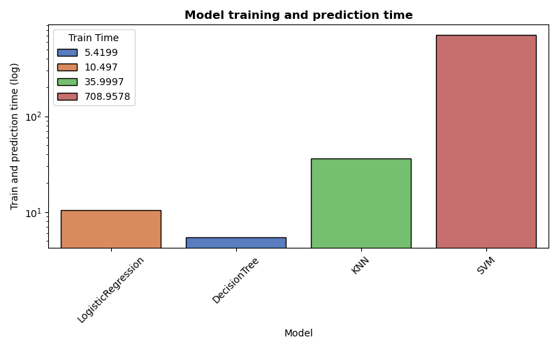
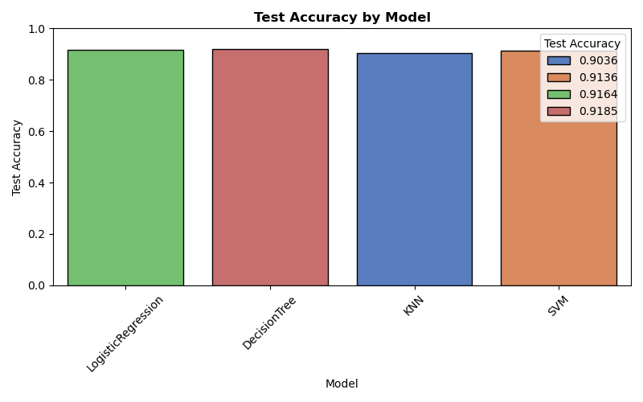
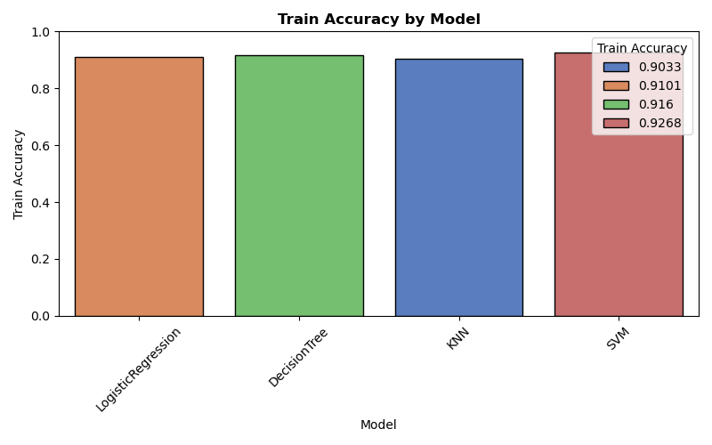
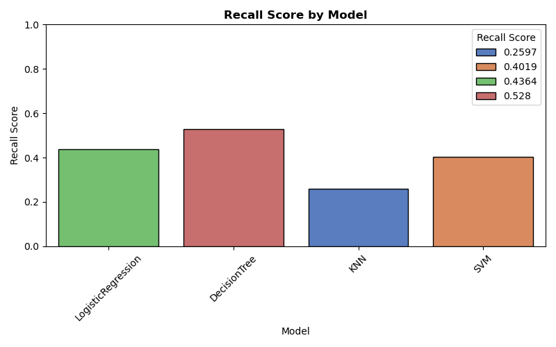

# bank_marketing_analysis
This is practical assignment 3 to analyse performance of different ML models on bank direct marketing data

## Problem Statement
The goal of this exercise is to evaluate performance and accuracy of different Classification models in ML on the given Bank Direct Marketing Dataset. Provide actionable feedback based on the analysis.

## Data Description
The dataset is taken from the UCI Machine Learning repository [link](https://archive.ics.uci.edu/ml/datasets/bank+marketing).  It comes from from a Portugese banking institution and is a collection of the results of multiple marketing campaigns. It contains client attributes like age, job, marital status, etc, there are some attributes of when was the client last contacted. Other socio-economic attributes are also included and finally the result of the marketing contact - whether the client accepted the offer of long term deposit or not.

The dataset is in the `/data` subfolder, file name `bank-additional-full.csv`.

## Dependencies
This project requires the following Python libraries:
- `matplotlib.pyplot` (for plotting)
- `seaborn` (for enhanced visualizations)
- `pandas` (for data manipulation)
- `numpy` (for numerical operations)

To run the code either use [Jupyter Notebook](https://jupyter.org/install) or upload the notebook and directories to [Google Colab](https://colab.research.google.com/).


Local setup:
```bash
 pip install matplotlib seaborn pandas numpy
 pip install notebook
```

## Repository Structure
```
├── data/                          # Directory for dataset
│   └── bank-additional-full.csv   # Main dataset of bank marketing campaign
│   ├──bank-additional-names.txt   # Description of dataset attributes
│   └── bank-additional.csv        # Additional dataset
├── images/                        # Directory for storing visualization images
├── bank_marketing_analysis.ipynb  # Jupyter Notebook with analysis
├── CRISP-DM-BANK.pdf              # White paper for the initial analysis of the data by Sérgio Moro Raul, M. S. Laureano and Paulo Cortez
└── README.md                      # Project documentation and analysis results
```

## Usage
1. Clone the repository:
    - Open terminal and run:
      `git clone https://github.com/nachiketpatil/bank_marketing_analysis.git`
2. Install dependencies:
   `pip install matplotlib seaborn pandas numpy`
3. Open the Jupyter Notebook:
   `jupyter notebook coupon_data_analysis.ipynb`
   Run the cells to explore the analysis.

## License
This project is public (Unlicense). Feel free to download and use the code for your own analysis.

## Analysis Report
### Business understanding:
This dataset comes from a Portuguese bank's marketing campaign aimed at getting customers to sign up for a long-term deposit. The goal of this analysis is to build a model that helps predict which customers are more likely to say "yes" when contacted and what are the most important attributes to focus on. At the same time, by analysing the performance of different models, we determine which model is best suited for the given dataset and relevance to the use case.

Such a model can make future campaigns more efficient by highlighting the key traits of likely customers. This helps the marketing team focus their time, calls, and efforts on the right people.

The data shows that past campaigns had low success rates. So, the main task of this machine learning project is to uncover what factors or combinations of factors lead to better results—and use that insight to improve future campaign performance.

### Data understanding:
From the description in paper, the dataset is collected from 17 campaigns that occurred between May 2008 and November 2010, corresponding to a total of 79354 contacts. The target is acceptance of the long term deposit offer (column 'y')
Exploratory Data Analysis (EDA) reveals the following key points:
- The dataset contains 41,188 rows and 21 columns.
- The target variable `y` indicates whether the client accepted the offer (1) or not (0) - there are 6499 accepts and 34,689 rejections (8% success rate).
- There are no null or missing values in the dataset.
- The dataset includes both categorical and numerical attributes, such as:
  - Categorical: job, marital status, education, contact communication type, month of last contact, day of week, etc.
  - Numerical: age, duration of last contact, number of contacts performed during this campaign, etc. 
  - The description of the attributes is available in the `bank-additional-names.txt` file.
- Most of the attributes are highly imbalanced like job, marital status, education, etc. including the target.

#### Feature correlation to the target:

Based on the correlation analysis, the most relevant features to the target variable `y` preliminarily look like:
- `duration` (duration of last contact)
- `nr.employed` (number of employees in the bank)
- `poutcome_success` (outcome of the previous marketing campaign)
- `month` (month of last contact)
- `pdays` (number of days since the client was last contacted)
- `euribor3m` (3-month Euribor rate - a socio-economic indicator)

### Data Preparation:
The dataset is already clean and does not contain any missing values. 
However, there are 11 categorical features that needed to be encoded for machine learning models.
- Categorical features were encoded using one-hot encoding.
- Numerical features were scaled using StandardScaler.
- The target variable `y` was converted to binary (0 and 1) using LabelEncoder for classification.
Resulting DataFrame has 41,188 rows and 64 columns (including the target variable).

### Baseline Models comparison:
For model comparison, we used the following classification models:
- Dummy Classifier
- Logistic Regression
- Decision Tree Classifier
- K-Nearest Neighbors Classifier
- Support Vector Classifier

Metrics for the model comparison:

| Model              | Train Time | Train Accuracy | Test Accuracy | Recall Score |
|--------------------|------------|----------------|---------------|--------------|
| DummyClassifier    | 0.034237   | 0.800243       | 0.803714      | 0.119612     |
| LogisticRegression | 0.113132   | 0.910288       | 0.916363      | 0.435345     |
| DecisionTree       | 0.187417   | 1.000000       | 0.896091      | 0.538793     |
| KNN                | 28.867960  | 0.918877       | 0.900825      | 0.323276     |
| SVM                | 76.007884  | 0.926798       | 0.913571      | 0.401940     |

The baseline models are the baseline on which we have to improve the performance in regards to above tabulated metrics.
Looking at these results, 
- Train time: Logistic regression and Decision Tree Classifier are the fastest models to train, while KNN and SVM take significantly longer.
- Train Accuracy: Decision Tree Classifier has the highest train accuracy (1.0), but this indicates overfitting. Logistic Regression and SVM also perform well on the training set.
- Test Accuracy: Logistic Regression has the highest test accuracy (0.916), followed closely by SVM (0.914). Decision Tree Classifier has a lower test accuracy (0.896) vs its train_accuracy, indicating overfitting.
- Recall Score: Decision Tree Classifier has the highest recall score (0.541), indicating it is better at identifying positive cases. Logistic Regression follows with a recall of 0.432, while SVM has a low recall of 0.191.

### Improving the models:
The technique used to improve the models is hyperparameter tuning using GridSearchCV where the models were iterated over with different hyperparameters for each model and the best parameters were selected based on the highest test accuracy score.
5-Fold Cross-validation (cv=5) was used to ensure the model's performance is consistent across different subsets of the data.

Performance of tuning and result metrics for each model:

| Model              | Train Time | Train Accuracy | Test Accuracy | Recall Score | Best Score | AUC     | Best Params Summary                                        |
|--------------------|------------|----------------|---------------|--------------|------------|---------|------------------------------------------------------------|
| LogisticRegression | 10.497     | 0.9164         | 0.9101        | 0.4364       | 0.9099     | 0.9424  | C=1, solver="liblinear", penalty="l2", scaled              |
| DecisionTree       | 5.4199     | 0.9185         | 0.916         | 0.528        | 0.912      | 0.9328  | max_depth=5, criterion="gini", min_samples_split=2, scaled |
| KNN                | 35.9997    | 0.9036         | 0.9033        | 0.2597       | 0.8972     | 0.8758  | n_neighbors=19, weights='uniform', scaled                  |
| SVM                | 708.9578   | 0.9268         | 0.9136        | 0.4019       | 0.9051     | 0.9393  | C=1, kernel='rbf', scaled                                  |

Visualization of the model performance metrics:
- Model train and predict times:



- Model Test and train accuracy scores:




- Model Recall scores:


From this model improvement analysis, we can see that:
- Logistic Regression does not improve significantly in terms of recall but maintains a good balance across all metrics.
- Decision Tree: Improvement in train and test accuracies but no improvement in recall.
- KNN: Slight improvement in test accuracy but recall remains low.
- SVM: There is no improvement in almost any aspect for SVM.

Because of the imbalance in target variable distribution, KNN and Decision Tree models were not able to improve the recall score significantly.
For same reason, KNN and SVM models take significantly longer to train and predict, which is not ideal for a production environment.


### Key Findings:
- <b>Performance Trade-offs</b>
  - Logistic Regression offers the best balance of all metrics with superior AUC performance
  - Decision Tree provides the highest recall but suffers from overfitting and lower precision
  - SVM demonstrates excellent precision and AUC but severely limited recall capability
  - KNN shows consistent performance but moderate results across all metrics

### Recommendations:
- <b>Selecting the Model based on Business Context</b>
  - For high-precision and accurate requirements: SVM or Logistic Regression
  - For real-time applications with low latency: Logistic Regression or Decision Tree
  - For consistent performance and no limit on train time: SVM
  - For high-recall requirements (capturing most positive cases): Decision Tree
  - For balanced performance: Logistic Regression provides optimal trade-off
  - For interpretability needs: Decision Tree offers clear decision pathways

- <b>Focusing on general features based on selected model</b>
  - `duration` (duration of last contact) is one of the attributes that appears as most important in almost all models. Focus on taking tme to explain the offer to the client, answering the questions, and addressing concerns.
  - `poutcome_success` (outcome of the previous marketing campaign) is another important feature. If the client has a positive experience from previous campaigns, they are more likely to accept the offer.
  - `nr.employed` (number of employees in the bank) is also a significant feature. It may indicate the bank's stability and reliability, which can influence the client's decision.
  - `month` (month of last contact - specially October) and `pdays` (number of days since the client was last contacted) are also important features. Timing of the contact can significantly impact the client's decision.
  - `euribor3m` (3-month Euribor rate) and `cons.price.idx` are socio-economic indicator that can influence the client's decision. It may indicate the overall economy stability and reliability, which can influence the client's decision.
